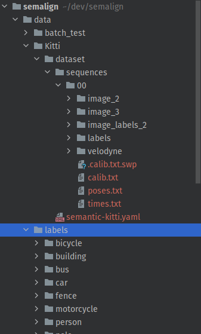

# LIDAR Camera Extrinsic Calibration with Semantic Labels and Estimated Monocular Depth

# Setup

```shell
python==3.10
numpy
torch
scipy
cv2
```

# Data setup
# Overview


The above is the data folder setup for the experiments. Do follow the above structure so that the source code runs 
seamlessly

## Set up experiment dir.

1. `mkdir /path/to/semalign/data/batch_test`
2. This will be the path where the experiment results will be saved (visualization and logging mostly)

## Download data from KITTI

1. Download the zip files from https://www.cvlibs.net/datasets/kitti/eval_odometry.php
2. We are only working with sequence 00 of the KITTI dataset.
3. Unzip it to `path/to/semalign/data/labels`

## Get the labels

1. Get it from https://drive.google.com/file/d/1DLJtCda9fjfWkGyhORbWo0uCAWQcfwgV/view?usp=sharing
2. Unzip it to `path/to/semalign/data/labels`

# Run experiments

## Modify hyperparameters
`main.py`
```python
    # Parse hyperparameters.
    rot_param_type = 'euler'  # 'axis_angle', 'euler', 'quaternion'
    lr = 1e-6  # learning rate
    rotation_degrees = dict(z=10, y=10, x=10)  # rotation to be introduced
    num_iter = 1000  # How many iterations to run the optimization.
    image_labels_subsampling_factor = 5.  # How sparse the image label will be.
    depth_scaling_factor = 1.  # How much weight to be given to the depth value as compared to the xy positions
    num_samples = 10  # How many samples to run a single batch optimization
    data_dump_dir = "../data/batch_test/"  # Where to dump your experiment results
```

## Run the optimization algorithm.

```shell
cd /path/to/semalign/src
python main.py
```

